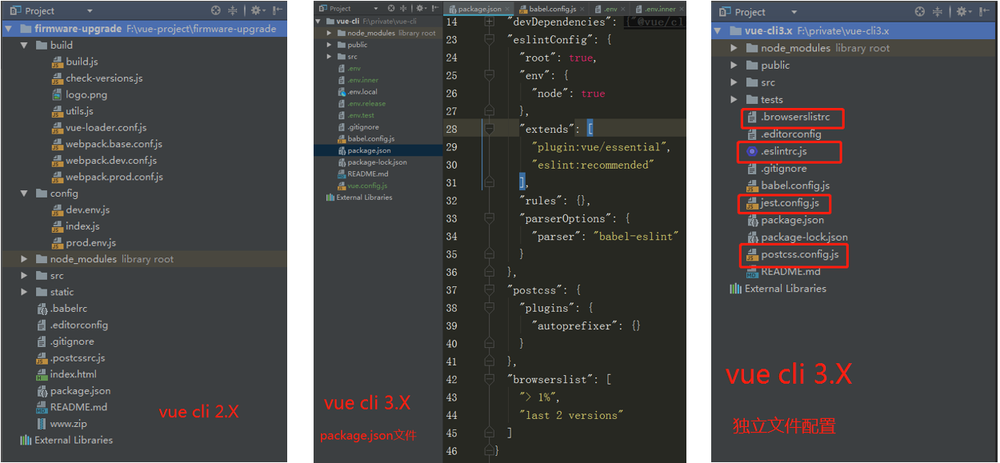
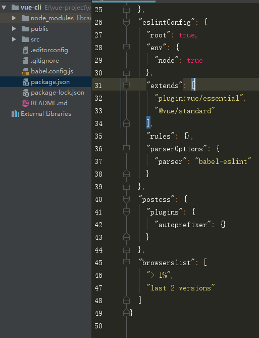

# @vue/cli 脚手架应用

​	此文章时根据自己实际使用的总结，内容主要是官方文档描述，部分地方添加有自己的使用讲解，如有描述不清晰的地方可直接查看官方文档，由于是根据个人需要进行的内容抽取，因此会有部分功能并未提及。同时欢迎各位读者指正文章中的不足和错误，在此表示感谢！


## 安装

```bash
npm install -g @vue/cli
# OR
yarn global add @vue/cli

```
注意事项： Vue CLI 需要 Node.js 8.9 或更高版本 (推荐 8.11.0+)。
Vue CLI 的包名称由 vue-cli 改成了 @vue/cli，如果你已经全局安装了旧版本的 vue-cli，
请先卸载旧版本

#### 卸载旧版本
```bash
npm uninstall vue-cli -g 
# OR
yarn global remove vue-cli

```

安装完成后，可直接用命令`vue -V` 检查是否安装成功，显示版本号即表示已经成功

## 创建项目

警告：Windows 上使用 Git Bash, 交互提示符并不工作（在windows 的cmd中使用交互
提示符可以正常工作），你必须通过 winpty vue.cmd create hello-world 启动这个命令。
不过，如果你仍想使用 vue create hello-world，则可以通过在 ~/.bashrc 
文件中添加以下行来为命令添加别名。 alias vue='winpty vue.cmd' 
你需要重新启动 Git Bash 终端会话以使更新后的 bashrc 文件生效。

```bash
Vue CLI v3.7.0
? Please pick a preset: (Use arrow keys)
> default (babel, eslint) // 默认
  Manually select features // 手动设置
  
  # 手动设置方式创建项目可以根据项目需求添加初始依赖
  # 通过箭头按键上下移动，空格进行选取或取消
  # 选取完成后回车，根据提示进行下一步的操作
  
  ? Please pick a preset: Manually select features
  ? Check the features needed for your project: (Press <space> to select, <a> to toggle all, <i> to invert selection)
>(*) Babel
 ( ) TypeScript
 ( ) Progressive Web App (PWA) Support
 ( ) Router
 ( ) Vuex
 ( ) CSS Pre-processors
 (*) Linter / Formatter
 ( ) Unit Testing
 ( ) E2E Testing

# 以下是本项目选取的依赖项
# 最后 Babel、PostCSS、ESlint 配置文件可选择使用独立文件
# 或者统一到package.json文件中

? Please pick a preset: Manually select features
? Check the features needed for your project: Babel, CSS Pre-processors, Linter
? Pick a CSS pre-processor (PostCSS, Autoprefixer and CSS Modules are supported by default): Sass/SCSS (with node-sass)
? Pick a linter / formatter config: Standard
? Pick additional lint features: (Press <space> to select, <a> to toggle all, <i> to invert selection)Lint on save
? Where do you prefer placing config for Babel, PostCSS, ESLint, etc.?
  In dedicated config files
> In package.json


```

由此步骤基本完成，等待依赖安装完成，进入项目目录，执行`npm run serve`即可启动项目

专用文件配置方式：



合并在package.json文件中:




如果你决定手动选择特性，在操作提示的最后你可以选择将已选项保存为一个将来可复用的 preset。


> ~/.vuerc
>
> 被保存的 preset 将会存在用户的 home 目录下一个名为 `.vuerc` 的 JSON 文件里。如果你想要修改被保存的 preset / 选项，可以编辑这个文件。

.vuerc 文件示例：

```bash
{
  "useTaobaoRegistry": true,
  "presets": {
    "default": {
      "useConfigFiles": true,
      "plugins": {
        "@vue/cli-plugin-babel": {},
        "@vue/cli-plugin-eslint": {
          "config": "standard",
          "lintOn": [
            "save"
          ]
        }
      },
      "router": true,
      "routerHistoryMode": true,
      "vuex": true,
      "cssPreprocessor": "node-sass"
    }
  }
}
```


### Babel

Babel 可以通过 `babel.config.js` 进行配置。

> TIP
>
> Vue CLI 使用了 Babel 7 中的新配置格式 `babel.config.js`。和 `.babelrc` 或 `package.json` 中的 `babel` 字段不同，这个配置文件不会使用基于文件位置的方案，而是会一致地运用到项目根目录以下的所有文件，包括 `node_modules` 内部的依赖。我们推荐在 Vue CLI 项目中始终使用 `babel.config.js` 取代其它格式。


### ESLint

ESLint 可以通过 `.eslintrc` 或 `package.json` 中的 `eslintConfig` 字段来配置。


## 使用图形化界面

通过 `vue ui` 命令以图形化界面创建和管理项目

上述命令会打开一个浏览器窗口，并以图形化界面将你引导至项目创建的流程。


## 拉取 2.x 模板 (旧版本)

Vue CLI >= 3 和旧版使用了相同的 `vue` 命令，所以 Vue CLI 2 (`vue-cli`) 被覆盖了。如果你仍然需要使用旧版本的 `vue init` 功能，你可以全局安装一个桥接工具：

```bash
npm install -g @vue/cli-init
# `vue init` 的运行效果将会跟 `vue-cli@2.x` 相同
vue init webpack my-project
```


## 插件和 Preset

[详细使用可查看官方文档](https://cli.vuejs.org/zh/guide/plugins-and-presets.html#%E6%8F%92%E4%BB%B6)

### 在现有的项目中安装插件

如果你想在一个已经被创建好的项目中安装一个插件，可以使用 `vue add` 命令：


> 提示
>
> `vue add` 的设计意图是为了安装和调用 Vue CLI 插件。这不意味着替换掉普通的 npm 包。对于这些普通的 npm 包，你仍然需要选用包管理器。<u>插件安装后没有直接的卸载命令</u>。


> 警告
>
> 我们推荐在运行 `vue add` 之前将项目的最新状态提交，因为该命令可能调用插件的文件生成器并很有可能更改你现有的文件。


## CLI 服务


### 使用命名


在一个 Vue CLI 项目中，`@vue/cli-service` 安装了一个名为 `vue-cli-service` 的命令。你可以在 npm scripts 中以 `vue-cli-service`、或者从终端中以 `./node_modules/.bin/vue-cli-service` 访问这个命令。

package.json文件中应用方式:

```bash
{
  "scripts": {
    "serve": "vue-cli-service serve",
    "build": "vue-cli-service build"
  }
}
```

如果你可以使用 [npx](https://github.com/zkat/npx) (最新版的 npm 应该已经自带)，也可以直接这样调用命令：

```bash
npx vue-cli-service serve
```


## 浏览器兼容性


### browserslist

 在`package.json` 文件里的 `browserslist` 字段 (或一个单独的 `.browserslistrc` 文件)，指定了项目的目标浏览器的范围。这个值会被 [@babel/preset-env](https://new.babeljs.io/docs/en/next/babel-preset-env.html) 和 [Autoprefixer](https://github.com/postcss/autoprefixer) 用来确定需要转译的 JavaScript 特性和需要添加的 CSS 浏览器前缀。

`package.json`

```js
{
  "browserslist": [
    "last 1 version",
    "> 1%",
    "maintained node versions",
    "not dead"
  ]
}
```

Or in `.browserslistrc` config:

```tex
# Browsers that we support

last 1 version
> 1%
maintained node versions
not dead
```


### Polyfill


#### useBuiltIns: 'usage'

一个默认的 Vue CLI 项目会使用 [@vue/babel-preset-app](https://github.com/vuejs/vue-cli/tree/dev/packages/%40vue/babel-preset-app)，它通过 `@babel/preset-env` 和 `browserslist` 配置来决定项目需要的 polyfill。

默认情况下，它会把 [`useBuiltIns: 'usage'`](https://new.babeljs.io/docs/en/next/babel-preset-env.html#usebuiltins-usage) 传递给 `@babel/preset-env`，这样它会根据源代码中出现的语言特性自动检测需要的 polyfill。这确保了最终包里 polyfill 数量的最小化。然而，这也意味着**如果其中一个依赖需要特殊的 polyfill，默认情况下 Babel 无法将其检测出来。**

如果有依赖需要 polyfill，你有几种选择：

1. **如果该依赖基于一个目标环境不支持的 ES 版本撰写:** 将其添加到 `vue.config.js` 中的 [`transpileDependencies`](https://cli.vuejs.org/zh/config/#transpiledependencies) 选项。这会为该依赖同时开启语法语法转换和根据使用情况检测 polyfill。
2. **如果该依赖交付了 ES5 代码并显式地列出了需要的 polyfill:** 你可以使用 `@vue/babel-preset-app` 的 [polyfills](https://github.com/vuejs/vue-cli/tree/dev/packages/%40vue/babel-preset-app#polyfills) 选项预包含所需要的 polyfill。**注意 es6.promise 将被默认包含，因为现在的库依赖 Promise 是非常普遍的。**

```js
// babel.config.js
module.exports = {
  presets: [
    ['@vue/app', {
      polyfills: [
        'es6.promise',
        'es6.symbol'
      ]
    }]
  ]
}
```


3.**如果该依赖交付 ES5 代码，但使用了 ES6+ 特性且没有显式地列出需要的 polyfill (例如 Vuetify)：请使用 useBuiltIns: 'entry' 然后在入口文件添加 import '@babel/polyfill'。这会根据 browserslist 目标导入所有** polyfill，这样你就不用再担心依赖的 polyfill 问题了，但是因为包含了一些没有用到的 polyfill 所以最终的包大小可能会增加。


### 现代模式


有了 Babel 我们可以兼顾所有最新的 ES2015+ 语言特性，但也意味着我们需要交付转译和 polyfill 后的包以支持旧浏览器。这些转译后的包通常都比原生的 ES2015+ 代码会更冗长，运行更慢。现如今绝大多数现代浏览器都已经支持了原生的 ES2015，所以因为要支持更老的浏览器而为它们交付笨重的代码是一种浪费。

Vue CLI 提供了一个“现代模式”帮你解决这个问题。以如下命令为生产环境构建：

```bash
vue-cli-service build --modern
```


> 提示
>
> <script type="module"> 需要配合始终开启的 CORS 进行加载。这意味着你的服务器必须返回诸如 Access-Control-Allow-Origin: * 的有效的 CORS 头。如果你想要通过认证来获取脚本，可使将 crossorigin 选项设置为 use-credentials。
>
> 同时，现代浏览器使用一段内联脚本来避免 Safari 10 重复加载脚本包，所以如果你在使用一套严格的 CSP，你需要这样显性地允许内联脚本：
>
> ```
> Content-Security-Policy: script-src 'self' 'sha256-4RS22DYeB7U14dra4KcQYxmwt5HkOInieXK1NUMBmQI='
> ```


### HTML 和 静态资源


#### Index 文件

`public/index.html` 文件是一个会被 [html-webpack-plugin](https://github.com/jantimon/html-webpack-plugin) 处理的模板。在构建过程中，资源链接会被自动注入。另外，Vue CLI 也会自动注入 resource hint (`preload/prefetch`、manifest 和图标链接 (当用到 PWA 插件时) 以及构建过程中处理的 JavaScript 和 CSS 文件的资源链接。


#### 插值

因为 index 文件被用作模板，所以你可以使用 [lodash template](https://lodash.com/docs/4.17.10#template) 语法插入内容：

- `<%= VALUE %>` 用来做不转义插值；
- `<%- VALUE %>` 用来做 HTML 转义插值；
- `<% expression %>` 用来描述 JavaScript 流程控制。

除了[被 `html-webpack-plugin` 暴露的默认值](https://github.com/jantimon/html-webpack-plugin#writing-your-own-templates)之外，所有[客户端环境变量](https://cli.vuejs.org/zh/guide/mode-and-env.html#using-env-variables-in-client-side-code)也可以直接使用。例如，`BASE_URL` 的用法：

```html
<link rel="icon" href="<%= BASE_URL %>favicon.ico">
```

#### Preload

[`<link rel="preload">`](https://developer.mozilla.org/zh-CN/docs/Web/HTML/Preloading_content) 是一种 resource hint，用来指定页面加载后很快会被用到的资源，所以在页面加载的过程中，我们希望在浏览器开始主体渲染之前尽早 preload。可以通过 `chainWebpack` 的 `config.plugin('preload')` 进行修改和删除。


#### Prefetch

[`<link rel="prefetch">`](https://developer.mozilla.org/en-US/docs/Web/HTTP/Link_prefetching_FAQ) 是一种 resource hint，用来告诉浏览器在页面加载完成后，利用空闲时间提前获取用户未来可能会访问的内容。

默认情况下，一个 Vue CLI 应用会为所有作为 async chunk 生成的 JavaScript 文件 ([通过动态 `import()`按需 code splitting](https://webpack.js.org/guides/code-splitting/#dynamic-imports) 的产物) 自动生成 prefetch 提示。可以通过 `chainWebpack` 的 `config.plugin('prefetch')` 进行修改和删除。

```js
// vue.config.js
module.exports = {
  chainWebpack: config => {
    // 移除 prefetch 插件
    config.plugins.delete('prefetch')

    // 或者
    // 修改它的选项：
    config.plugin('prefetch').tap(options => {
      options[0].fileBlacklist = options[0].fileBlacklist || []
      options[0].fileBlacklist.push(/myasyncRoute(.)+?\.js$/)
      return options
    })
  }
}
```


> 提示
>
> Prefetch 链接将会消耗带宽。如果你的应用很大且有很多 async chunk，而用户主要使用的是对带宽较敏感的移动端，那么你可能需要关掉 prefetch 链接并手动选择要提前获取的代码区块。


## 处理静态资源


#### `public` 文件夹

任何放置在 `public` 文件夹的静态资源都会被简单的复制，而不经过 webpack。你需要通过绝对路径来引用它们。

注意我们推荐将资源作为你的模块依赖图的一部分导入，这样它们会通过 webpack 的处理并获得如下好处：

- 脚本和样式表会被压缩且打包在一起，从而避免额外的网络请求。
- 文件丢失会直接在编译时报错，而不是到了用户端才产生 404 错误。
- 最终生成的文件名包含了内容哈希，因此你不必担心浏览器会缓存它们的老版本。

`public` 目录提供的是一个**应急手段**，当你通过绝对路径引用它时，留意应用将会部署到哪里。如果你的应用没有部署在域名的根部，那么你需要为你的 URL 配置 [publicPath](https://cli.vuejs.org/zh/config/#publicpath) 前缀：

#### 何时使用 `public` 文件夹

- 你需要在构建输出中指定一个文件的名字。
- 你有上千个图片，需要动态引用它们的路径。
- 有些库可能和 webpack 不兼容，这时你除了将其用一个独立的 `<script>` 标签引入没有别的选择。

## 

## CSS 相关


### 自动化导入

如果你想自动化导入文件 (用于颜色、变量、mixin……)，你可以使用 [style-resources-loader](https://github.com/yenshih/style-resources-loader)。以下是一个Stylus 文件例子：

```js
// vue.config.js
const path = require('path')
/*
* 可在所有style文件中引用 variables / mixins / functions, 不必在每个文件中@import
* 仅支持 .css .sass .scss .less .styl 类型的文件
*/


module.exports = {
  chainWebpack: config => {
    const types = ['vue-modules', 'vue', 'normal-modules', 'normal']
    types.forEach(type => addStyleResource(config.module.rule('stylus').oneOf(type)))
  },
}

function addStyleResource (rule) {
  rule.use('style-resource')
    .loader('style-resources-loader')
    .options({
      patterns: [
        path.resolve(__dirname, './src/styles/imports.styl'),
      ],
    })
}
```


> ###### 提示：
>
> 此方式引入的文件不是显示的引用文件，文件被修改后保存不会触发更新，可通过修改其他显示引用的文件触发webpack的热更新


### 向预处理器 Loader 传递选项

向 webpack 的预处理器 loader 传递选项。你可以使用 `vue.config.js` 中的 `css.loaderOptions` 选项。比如你可以这样向所有 Sass 样式传入共享的全局变量：


```js
// vue.config.js
/*
* 可配配置以下loader
    css-loader
    postcss-loader
    sass-loader
    less-loader
    stylus-loader
*/

module.exports = {
  css: {
    loaderOptions: {
      // 给 sass-loader 传递选项
      // 根据项目中使用的css 预编译语言添加 loader选项  
      sass: {
        // @/ 是 src/ 的别名
        // 所以这里假设你有 `src/variables.scss` 这个文件
        // 切记分号不可省略，否则引入失败，多个文件直接拼接即可 
        data: `@import "~@/variables.scss";@import "~@/mixin.scss";`
      }
    }
  }
}
```


> 提示
>
> 这样做比使用 `chainWebpack` 手动指定 loader 更推荐，因为这些选项需要应用在使用了相应 loader 的多个地方。


## 环境变量和模式

你可以替换你的项目根目录中的下列文件来指定环境变量：

```tex
.env                # 在所有的环境中被载入
.env.local          # 在所有的环境中被载入，但会被 git 忽略
.env.[mode]         # 只在指定的模式中被载入
.env.[mode].local   # 只在指定的模式中被载入，但会被 git 忽略
```


### 模式

**模式**是 Vue CLI 项目中一个重要的概念。默认情况下，一个 Vue CLI 项目有三个模式：

- `development` 模式用于 `vue-cli-service serve`
- `production` 模式用于 `vue-cli-service build` 和 `vue-cli-service test:e2e`
- `test` 模式用于 `vue-cli-service test:unit`

注意模式不同于 `NODE_ENV`，一个模式可以包含多个环境变量。也就是说，每个模式都会将 `NODE_ENV`的值设置为模式的名称——比如在 development 模式下 `NODE_ENV` 的值会被设置为 `"development"`。

你可以通过为 `.env` 文件增加后缀来设置某个模式下特有的环境变量。比如，如果你在项目根目录创建一个名为 `.env.development` 的文件，那么在这个文件里声明过的变量就只会在 development 模式下被载入。

你可以通过传递 `--mode` 选项参数为命令行覆写默认的模式。例如，如果你想要在构建命令中使用开发环境变量，请在你的 `package.json` 脚本中加入：

```json
"dev-build": "vue-cli-service build --mode development"
```


### 环境变量使用

只有以 `VUE_APP_` 开头的变量会被 `webpack.DefinePlugin` 静态嵌入到客户端侧的包中。你可以在应用的代码中这样访问它们：

```js
console.log(process.env.VUE_APP_SECRET)
```

在构建过程中，`process.env.VUE_APP_SECRET` 将会被相应的值所取代。在 `VUE_APP_SECRET=secret` 的情况下，它会被替换为 `"sercet"`。

除了 `VUE_APP_*` 变量之外，在你的应用代码中始终可用的还有两个特殊的变量：

- `NODE_ENV` - 会是 `"development"`、`"production"` 或 `"test"` 中的一个。具体的值取决于应用运行的[模式](https://cli.vuejs.org/zh/guide/mode-and-env.html#%E6%A8%A1%E5%BC%8F)。
- `BASE_URL` - 会和 `vue.config.js` 中的 `publicPath` 选项相符，即你的应用会部署到的基础路径。

所有解析出来的环境变量都可以在 `public/index.html` 中以 [HTML 插值](https://cli.vuejs.org/zh/guide/html-and-static-assets.html#%E6%8F%92%E5%80%BC)中介绍的方式使用。

> 提示
>
> 你可以在 `vue.config.js` 文件中计算环境变量。它们仍然需要以 `VUE_APP_` 前缀开头。这可以用于版本信息 `process.env.VUE_APP_VERSION = require('./package.json').version`。

