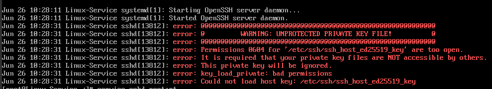

# 			Linux 使用问题汇总


> 提示： 个人使用的是 Centos 7.2 的系统，当前问题总结是以此操作系统为基础，不同的系统或者版本在同样的问题中可能表现和处理方式不同，如果使用的系统不相同，以下问题处理方式可能会不适用


### 查询linux 系统版本信息


```sh
lsb_release -a           // linux通用命令
cat /etc/system-release  // 查看系统发行版本信息
```


### 1. ssh 连接 Socket error Event: 32 Error: 10053. 错误处理

问题原因： 这个是由于文件权限问题导致的, 或者网络不稳定

处理方式：

1. 通过命令`service sshd status`查找`sshd`服务具体报错原因

   以下是添加了私有的key后产生的问题

   

 之后根据具体错误信息设置相应文件的权限，当前问题对 `ssh_host_ed25519_key` 文件设置权限即可，设置完成后 `service sshd restart` 命令重启 sshd 服务

```
cd /etc/ssh
chmod 400 *
```

如果重启服务后，重新查看 `sshd`  服务状态无异常，即说明问题处理完成， 重新使用 xshell 连接服务就可正常使用

2. 如果是 `service sshd status` 查看sshd 服务无异常，但是使用 ssh 工具连接Linux服务仍出现`Socket error Event: 32 Error: 10053.` 错误信息，可采取下面处理方式

   修改配置文件

   ```
   vim /etc/ssh/sshd_config
   ```

   更改 `/etc/sshd_config` 文件 中的两个值  `ClientAliveInterval`   和   `ClientAliveCountMax`

   ```
   ClientAliveInterval 60 // 服务器端向客户端请求消息的时间间隔, 默认是0, 不发送
   ClientAliveCountMax 3  // 服务器发出请求后客户端没有响应的次数达到一定值, 就自动断开
   ```

3. 如果客户端电脑再局域网中ip 冲突也会出现此问题


### 2. 安装依赖包时 `Error: EACCES: permission denied, mkdir '/.../node_modules/.../'` 错误处理


```
sudo npm install node-sass
```

以node-sass安装报错为例，以 `sudo npm install ` 方式即可

```
sudo npm install node-sass --unsafe-prem=true
```

  如果加了 `sudo` 仍然不行，可以再加上 后置参数