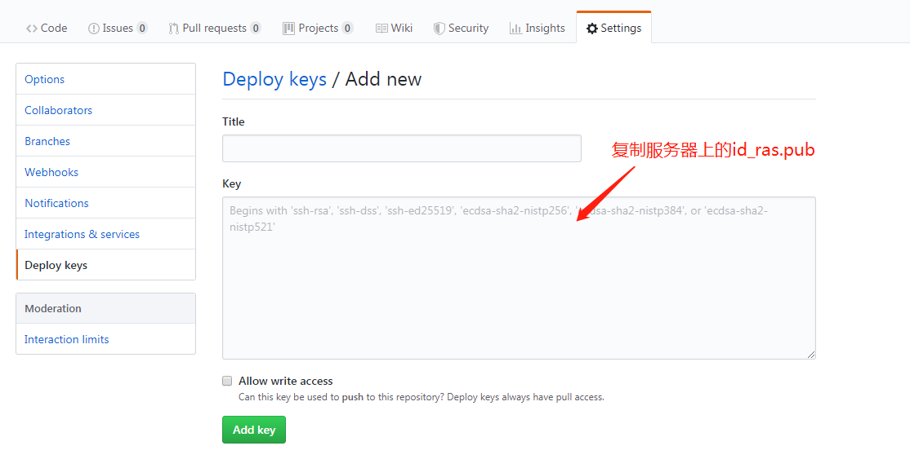

#       github项目通过webhooks实现自动部署

### 前言

​	本文介绍的是前端 `vue` 项目，在 `github` 上通过 `webhook` 实现自动部署的过程，主要作为学习使用记录，便于以后使用时翻阅。如果文中有不当或者错误，欢迎各位读者指正，在此先表示感谢！


##### 准备工作

1. github 账号，并且有一个项目仓库
2. Linux 服务器一台， 本人使用的 Centos 7.6


### 服务器环境部署

1. #####  ssh 工具连接Linux服务器

2. ##### 安装项目环境

    2.1.    git:   `yum install git` 

    2.2.   node 、npm 安装

   ```bash
   cd /home
   wget https://nodejs.org/dist/v10.16.0/node-v10.16.0-linux-x64.tar.xz
   
   # 解压预编译文件包
   tar xvJf node-v10.16.0-linux-x64.tar.xz
   
   # 建立软链接，方便 node、npm 命令全局使用
   ln -s /home/node-v10.16.0-linux-x64/bin/node /usr/bin/node
   ln -s /home/node-v10.16.0-linux-x64/bin/npm /usr/bin/npm
   
   # 查看node、npm 版本确认安装是否正确, 如下输出版本信息就说明安装正常
   node -v
   v10.16.0
   npm -v
   6.9.0
   ```

   

   >  	注：vue-cli 需要node、npm 安装成功后才可以进行，因此下一步必须在这一步完成无误后进行。新手尽量不要用.tar.gz 的源码包进行安装，由于需要编译，而且需要安装其他应用，此处不做源码包安装说明（因为我也不会 ლ(╹ε╹ლ) ）。另外此处不要使用 `yum install nodejs` 和 `yum install npm`  安装， `yum` 安装的版本node太低，`vue-cli` 会无法使用， 如果项目对node 版本无要求可以直接使用

   

   2.3.   vue-cli:  `npm install -g @vue/cli`

   ​	vue项目构建时使用，如果不是vue 项目此项可以忽略

   2.4.  pm2:   `npm install -g pm2`

   ​	管理node 进程，方便node进程后台运行的控制， 普通node启动会在命令窗口关闭时关闭node 进程

​	

3. github-webhook-handler 服务部署

   3.1.  shell 脚本目录下初始化一个  `package.json`

   ```shell
   npm init -f
   ```

   3.2. 安装 [github-webhook-handler]( https://github.com/rvagg/github-webhook-handler) 第三方库

   ```shell
   npm i -S github-webhook-handler
   ```

   3.3. 编写执行脚本 `deploy.js`

   ​	此文件放置在shell 脚本同级目录下

   ```js
   var http = require('http')
   // 此模块为node自身包含的，不用npm安装
   var spawn = require('child_process').spawn
   // 此模块需要添加到package.json文件中
   var createHandler = require('github-webhook-handler')
   var handler = createHandler({
     path: '/autoBuildWeb',
     secret: '123456'
   })
   http.createServer(function (req, res) {
     handler(req, res, function () {
       res.statusCode = 404
       res.end('no such location')
     })
   }).listen(3000)
   
   handler.on('error', function (err) {
     console.error('Error:', err.message)
   })
   
   handler.on('push', function (event) {
     console.log('Received a push event for %s to %s',
       event.payload.repository.name,
       event.payload.ref)
     // 此处.sh文件名对应shell脚本文件名
     rumCommand('sh', ['./deploy.sh'], function (txt) { 
       console.log(txt)
     })
   })
   
   function rumCommand (cmd, args, callback) {
     var child = spawn(cmd, args)
     var response = ''
     child.stdout.on('data', function (buffer) {
       response += buffer.toString()
     })
     child.stdout.on('end', function () {
       callback(response)
     })
   }
   ```

   3.4. 使用 `pm2` 启动服务

   ```
   pm2 start deploy.js
   ```

   

4. nginx 配置

   nginx 服务启用80端口，脚本是另一个端口，因此需要添加接口代理

   ```sh
   server {
     listen 80;
     
     ...
     location /autoBuildWeb {
       proxy_pass http://localhost:3000;
       proxy_redirect off;
     }
     ...
   }
   ```


### github项目配置

1. 编写shell 脚本

   项目根目录下添加  `deploy.sh` 文件（脚本文件名根据实际项目定义来修改）， 脚本示例如下

   ```shell
   cd /home/git/vue-cli/
   git fetch --all
   git reset --hard origin/master
   sudo npm install
   npm run build
   if [ $? -eq 0 ]
   then
   rm -rf /home/projects/web/dist/*
   cp -R /home/git/vue-cli/dist/ /home/projects/web/ -f
   else
    echo 'npm run build failed'
   fi
   ```

   

   > ​	此示例中  `/home/git/vue-cli` 为服务器上vue 项目存放地址， `/home/projects/web/` 为构建后dist 文件放置地址。在Lix服务器上可以用 `sh -n xxx.sh` 检测 shell 脚本是否有语法错误， 使用 `sh -vx xxxx.sh`  命令调试 shell 脚本

   

2. 生成公钥

   ```
   ssh-keygen
   ```

   输入以上命令后直接回车，完成后再用户根目录会生成.ssh目录，如有已有.ssh 目录可以直接使用 `cat ~/.ssh/id_ras.pub`  后复制公钥文件

   

3. 项目 `Settings` > `Deploy keys`  中添加服务器公钥

   

   

   4. 服务器上初始化项目

      项目首次部署时，需要在服务器 `git clone`  

   5. webhook 配置

      

      


​	以上步骤都完成后，添加一个新的 `commit` , 再 `push` 到  `github` , 服务器上就会自动构建部署你的项目， 至此 `vue` 项目在 `github`上以 `webhooks` 实现自动部署就完成了。