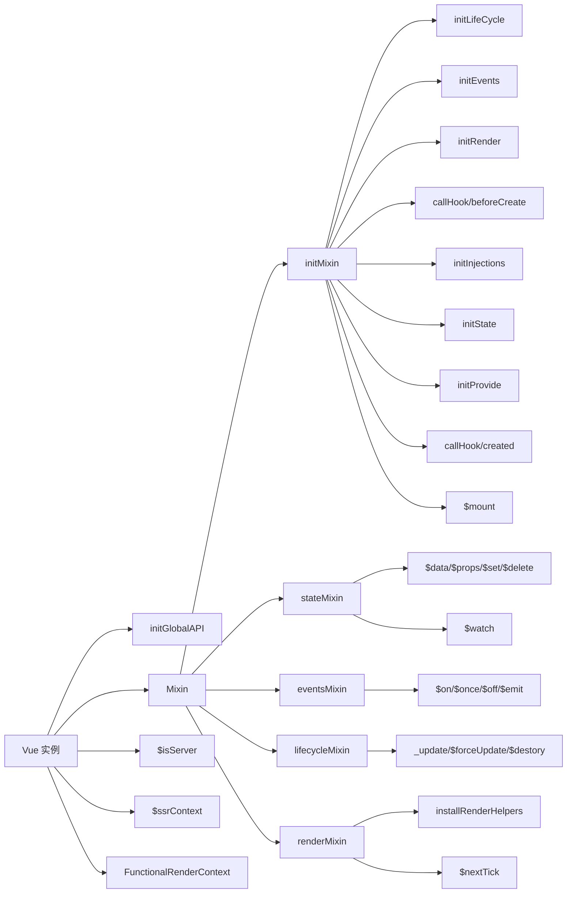

# 源码解读2

## 学习源码思路

整理源码学习的整体学习方式，梳理 `Vue` 实现的整理流程

确定入口文件，执行了哪些主要方法，方法的执行顺序，方法执行处理了哪些内容。

​	以下思维导图中主要关注的 `Vue` 在 `web` 中 `SPA` 的实现方式，`ssr` 部分未做详细分解

> 1.  `inject` :  `resolve injections before data/props`  
>
>    `provide` :  `resolve provide after data/props` 
>
>    需要注意二者其执行顺序
>
> 2.  `eventsMixin`  中表明子组件中的事件是由自身来派发和监听的，最终是回调函数在父组件中定义

new Vue() -->  _init -->  

### 数据响应式

首先初始化 props / data （`initProps` / `initData`）

observe  为 data 创建一个 `Observer` 实例

`Obserser`  遍历对象属性，做相应的处理，进行依赖收集 和 派发更新

- 

DefineReactive 给data 中的每个 key 添加数据劫持

