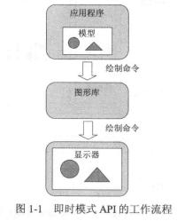
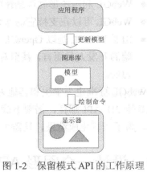
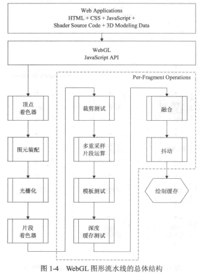
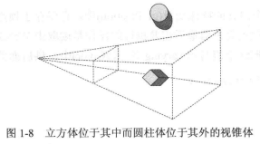

# WebGL 学习记录

## 一、WebGL 基础

​	WebGL 是用来在Web 上生成三维图形效果的应用编程接口。它是以OpenGL ES 2.0 为基础，与OpenGL一样，它也提供绘制功能，但是它是应用在HTML和JavaScript上下文中。WebGL 绘制曲面的本质是HTML5 的画布。

#### 图形API

​	图形API基本包含两种模式：

 * 即时模式API

 * 保留模式API

   WebGL 属于即时模式API

   * 即时模式API

     对于即时模式API(immediate-mode API)， 每一帧的场景，不管是否已发生变化，都需要重新绘制。提供API的图形库并没有保存需要绘制场景的内部模型，但是应用程序需要在内存中用自己的方法表示场景。这种设计模式提高了应用程序的灵活性和控制能力。但是，它需要应用程序执行更多的操作，如跟踪场景的模型、执行初始化和清除操作。

   

   

   * 保留模式API

     提供保留模式API（retained-mode API）的图形库包含一个内部模型或场景图形。它包含了所有需要绘制的对象。当应用程序调用保留模式API时，图形库决定什么在屏幕执行绘制的时机，不需为绘制每一帧的场景执行命令。某些方面，保留模式API更容易使用。保留模式API 的示例是可缩放的矢量图（SVG）



#### WebGL 图形流水线

​	在支持WebGL 的浏览器中，JavaScript调用WebGL API，并把有关3D模型的绘制信息传个WebGL流水线，其中包含两个可编程着色器（定点着色器和片段着色器）源码，和有关3D模型绘制信息。

​	当图形数据通过整个WebGL流水线后，GPU就把结果写入到WebGL称之为绘制缓存的内存中。绘制缓存内容传到物理帧缓存之前，需要与HTML页面中的其他内容进行组合。最终物理缓存中的实际结果直接显示在屏幕上。



1. 顶点着色器

   ​	顶点着色器就是流水线中对顶点进行着色的阶段。顶点着色器是可编程的，即用户可以自己设计顶点的着色器源码，并用JavaScript API传入。

   顶点着色器输入内容包括：

   * 顶点着色器源码  OpenGL ES 着色语言（OpenGL ES Shading Language , GL SL ES）设计的

   * attribute 变量 （属性变量） 用户自定义变量

   * uniform 变量 （恒值变量） 表示所有顶点都相同的数据

   * varying 变量 （易变变量） 顶点着色器想片段着色器发送信息的一个手段

     

     以下是顶点着色器源代码片段示例：

     ```javascript
     attribute vec3 aVertexPos;
     attribute vec4 aVertexColor;
     
     uniform mat4 uMVMatrix;
     uniform mat4 uPMatrix;
     
     varying vec4 vColor;
     
     void main () {
         gl_Position = uPMatrix * uMVMatrix * vec4(aVertexPos, 1.0);
         
         vColor = aVertexColor;
     }
     
     ```

2. 图元装配

   ​	把已经着色的顶点装配成三角形、线段或点精灵等几何图元，然后对每个三角形、线段或点精灵判断它们是否在屏幕上可见的3D区域，删除出去视椎体之外的图元，构成视椎体的图元传送到下一阶段。

   

3. 光栅化

   ​	把图元（线段、三角形和点精灵）转换为片段，我们可以把片段看成最终绘制在屏幕上的一个像素，然后把片段传给片段着色器。

4. 片段着色器

   ​	着色器（Shader) 是用来实现图像渲染的，用来替代固定渲染管线的可编辑程序，可实现3D图形学计算中的相关计算。片段着色器主要负责片段颜色等的计算

   片段着色器源码示例：

```javascript
percision mediump float;

varying vec4 vColor;
void main () {
    gl_FragColor = vColor;
}
```

​	

​	提示：着色器源码涉及内容比较多，直接参考相关资源更加详尽 ，可参考 [https://thebookofshaders.com/?lan=ch](https://thebookofshaders.com/?lan=ch)

