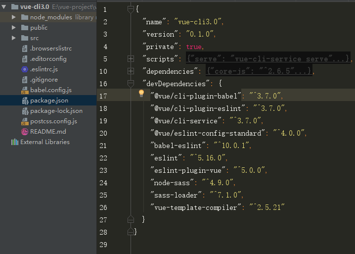
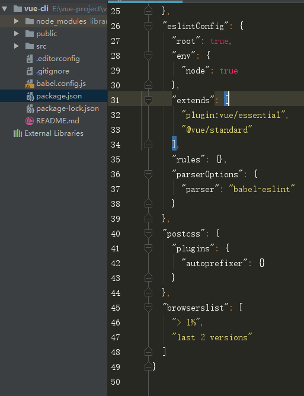

# @vue/cli 脚手架应用

## 安装

```bash
npm install -g @vue/cli
# OR
yarn global add @vue/cli

```
注意事项： Vue CLI 需要 Node.js 8.9 或更高版本 (推荐 8.11.0+)。
Vue CLI 的包名称由 vue-cli 改成了 @vue/cli，如果你已经全局安装了旧版本的 vue-cli，
请先卸载旧版本

#### 卸载旧版本
```bash
npm uninstall vue-cli -g 
# OR
yarn global remove vue-cli

```

安装完成后，可直接用命令`vue -V` 检查是否安装成功，显示版本号即表示已经成功

## 创建项目

警告：Windows 上使用 Git Bash, 交互提示符并不工作，
你必须通过 winpty vue.cmd create hello-world 启动这个命令。
不过，如果你仍想使用 vue create hello-world，则可以通过在 ~/.bashrc 
文件中添加以下行来为命令添加别名。 alias vue='winpty vue.cmd' 
你需要重新启动 Git Bash 终端会话以使更新后的 bashrc 文件生效。

```bash
Vue CLI v3.7.0
? Please pick a preset: (Use arrow keys)
> default (babel, eslint)
  Manually select features
  
  # 选取Manually select features方式创建项目可以根据项目需求添加初始依赖
  # 通过箭头按键上下移动，空格进行选取或取消
  # 选取完成后回车，根据提示进行下一步的操作
  
  ? Please pick a preset: Manually select features
  ? Check the features needed for your project: (Press <space> to select, <a> to toggle all, <i> to invert selection)
>(*) Babel
 ( ) TypeScript
 ( ) Progressive Web App (PWA) Support
 ( ) Router
 ( ) Vuex
 ( ) CSS Pre-processors
 (*) Linter / Formatter
 ( ) Unit Testing
 ( ) E2E Testing

# 以下是本项目选取的依赖项
# 最后 Babel、PostCSS、ESlint 配置文件可选择使用独立文件
# 或者统一到package.json文件中

? Please pick a preset: Manually select features
? Check the features needed for your project: Babel, CSS Pre-processors, Linter
? Pick a CSS pre-processor (PostCSS, Autoprefixer and CSS Modules are supported by default): Sass/SCSS (with node-sass)
? Pick a linter / formatter config: Standard
? Pick additional lint features: (Press <space> to select, <a> to toggle all, <i> to invert selection)Lint on save
? Where do you prefer placing config for Babel, PostCSS, ESLint, etc.?
  In dedicated config files
> In package.json


```

由此步骤基本完成，等待依赖安装完成，进入项目目录，执行`npm run serve`即可启动项目

专用文件配置方式：



合并在package.json文件中:


